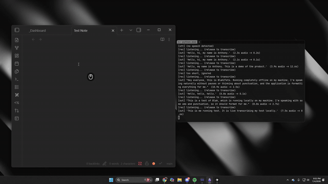

<p align="center">
  
</p>

<div align="center">

# blah2text

### A local, fully-offline Wispr Flow-style push-to-talk dictation app for Windows

<a href="LICENSE"></a>


</div>

---

<details>
<summary>Table of Contents</summary>

- [Overview](#overview)
- [Features](#features)
- [Requirements](#requirements)
- [Install](#install)
- [Usage](#usage)
- [Configuration](#configuration-configtoml)
- [Tests](#tests)
- [Roadmap](#roadmap-documented-stubs-not-yet-implemented)
- [Credits](#credits)
- [License](#license)

</details>

## Overview

[Wispr Flow](https://wisprflow.ai/) does this in the cloud; blah2text does it
on your machine. Hold a hotkey, speak, release — your words are transcribed
by a local Whisper model, cleaned up by a local LLM, and typed at your cursor
in whatever app has focus. No cloud, no telemetry.

**Pipeline:** mic → [faster-whisper](https://github.com/SYSTRAN/faster-whisper)
(CTranslate2, Silero VAD) → rule-based cleanup → [Ollama](https://ollama.com)
LLM cleanup → clipboard-paste or SendInput injection.

## Features

- **Push-to-talk dictation** - hold a configurable hotkey, speak, release; text appears at your cursor.
- **Fully offline** - Whisper transcription and Ollama cleanup both run locally; no cloud calls, no telemetry.
- **GPU with automatic CPU fallback** - uses CUDA float16 when available, silently drops to CPU int8 if not.
- **Latency-aware cleanup** - a rule-based pass always runs; short utterances skip the LLM entirely; a stalled Ollama never blocks dictation.
- **Two injection methods** - clipboard paste (fast, with terminal-aware `Ctrl+Shift+V`) or raw `SendInput` keystrokes (works where paste doesn't).
- **Recording visualizer** - a transparent, click-through waveform overlay reacts to your voice while you hold the hotkey.

## Requirements

- Windows 10/11
- Python 3.11+ (3.12 recommended)
- [Ollama](https://ollama.com/download) for AI cleanup (optional but recommended)
- NVIDIA GPU optional — falls back to CPU automatically

## Install

```powershell
python -m venv .venv
.venv\Scripts\activate
pip install -r requirements.txt
```

Pull the cleanup model (one-time, ~4.7 GB):

```powershell
ollama pull qwen2.5:7b
```

Smaller alternatives (set `[cleanup] model` in `config.toml`):
`ollama pull gemma3:4b` or `ollama pull llama3.2:3b`.

> [!NOTE]
> The Whisper model weights download automatically on first run (cached
> under `%USERPROFILE%\.cache\huggingface`). After that, everything runs
> offline.

### RTX 50-series (Blackwell) note

RTX 50-series GPUs are compute capability **sm_120** and need a CUDA 12.8
build of CTranslate2. If you see a CUDA error on startup, run:

```powershell
pip install --upgrade "ctranslate2>=4.6.0"
```

blah2text never crashes on a broken CUDA setup — it prints a message and
falls back to CPU (int8), which is still fast for `small.en`.

To enable GPU decoding you also need the cuBLAS/cuDNN 9 DLLs on your PATH.
The easiest way is via pip, then restart the app:

```powershell
pip install nvidia-cublas-cu12 nvidia-cudnn-cu12
```

(If CUDA still fails, the printed `[stt]` message tells you why — the app
keeps working on CPU either way.)

## Usage

```powershell
python run.py
```

- **Hold `F9`** (configurable) and speak.
- **Release** — the audio is transcribed, cleaned, and injected at your cursor.

Try the pipeline without a microphone:

```powershell
python run.py --dry-run samples\test_phrase.wav
```

List audio input devices: `python run.py --list-devices`.

## Configuration (`config.toml`)

| Section     | Key                 | Default            | Notes |
|-------------|---------------------|--------------------|-------|
| `hotkey`    | `key`               | `"f9"`             | push-to-talk key ([key names](https://pypi.org/project/global-hotkeys/)) |
| `audio`     | `device`            | `-1`               | `-1` = default mic |
| `stt`       | `model`             | `"small.en"`       | `tiny.en` … `large-v3` |
| `stt`       | `device`            | `"auto"`           | CUDA float16 → CPU int8 fallback |
| `cleanup`   | `model`             | `"qwen2.5:7b"`     | any Ollama model |
| `cleanup`   | `min_words_for_llm` | `10`               | shorter utterances skip the LLM |
| `inject`    | `method`            | `"clipboard"`      | `"clipboard"` or `"type"` |
| `visualizer`| `enabled`           | `true`             | waveform overlay while recording |
| `visualizer`| `color`             | `"#e8e8e8"`        | bar color (any Tk color) |
| `visualizer`| `background`        | `"transparent"`    | `"transparent"` or a solid color |

### The two injection methods

- **`clipboard`** (default): saves your current clipboard text, puts the
  transcript on the clipboard, sends `Ctrl+V`, then restores the old
  clipboard. Instant even for long text. (Non-text clipboard contents, e.g.
  images, can't be saved/restored.)

  When the focused app is a known terminal (`terminal_processes` in
  config.toml — WezTerm, Windows Terminal, Alacritty, ...), it sends
  `Ctrl+Shift+V` instead. The terminal intercepts that chord and feeds the
  clipboard to the inner program as typed input, so pasting works even in
  TUIs (Claude Code, vim, REPLs) that have no `Ctrl+V` binding of their own.
- **`type`**: synthesizes real keystrokes with Win32 `SendInput` +
  `KEYEVENTF_UNICODE`. Works in apps that ignore paste — including many
  terminals — and doesn't touch the clipboard. Slower for long text.

### Recording visualizer

While you hold the hotkey, a minimal waveform strip appears at the bottom
center of your main screen and reacts to your voice, then disappears on
release. It's a transparent, borderless, click-less tkinter overlay driven
by per-block mic RMS — effectively zero overhead on the dictation pipeline.
Customize (or disable) it in the `[visualizer]` section of config.toml:
bar `color`, `background` (`"transparent"` or a solid color like
`"#16222e"`), size, bar count, `fps`, and `gain` (sensitivity).

### Cleanup behavior (latency rules)

1. A rule-based pass **always** runs: collapses whitespace and strips
   standalone fillers (*um, uh, hmm, er, ah*). It never deletes real words.
2. Utterances under 10 words **skip the LLM entirely** — short commands
   appear instantly.
3. If Ollama is down or times out, the rule-cleaned text is used. Dictation
   never blocks on the LLM.

The LLM is instructed to fix casing/punctuation and remove false starts
**without changing meaning**. Everything stays on your machine.

## Tests

```powershell
pytest -q
```

Smoke tests cover filler stripping, the skip-LLM latency branch, and
injection dispatch (OS and Ollama calls are mocked).

## Roadmap (documented stubs, not yet implemented)

- **Custom vocabulary** (`[vocabulary]` in config.toml): user-defined
  replacements applied after STT — names, jargon, acronyms.
- **Voice commands** (`[commands]`): "new line", "delete that", etc.
- A cloud formatter could exist behind an off-by-default flag; the core
  path makes **no** cloud calls.

## Credits

Architecture informed by
[drajb/whisper-local](https://github.com/drajb/whisper-local) (Windows
push-to-talk + optional Ollama cleanup) and
[xarthurx/whisperi](https://github.com/xarthurx/whisperi) (Win32 SendInput
injection into any app, including terminals).

## License

MIT — see [LICENSE](LICENSE).
